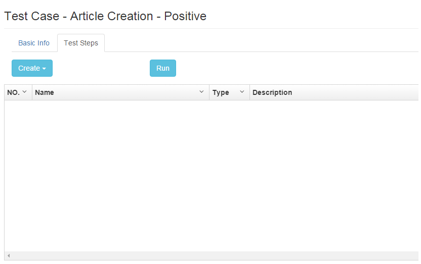
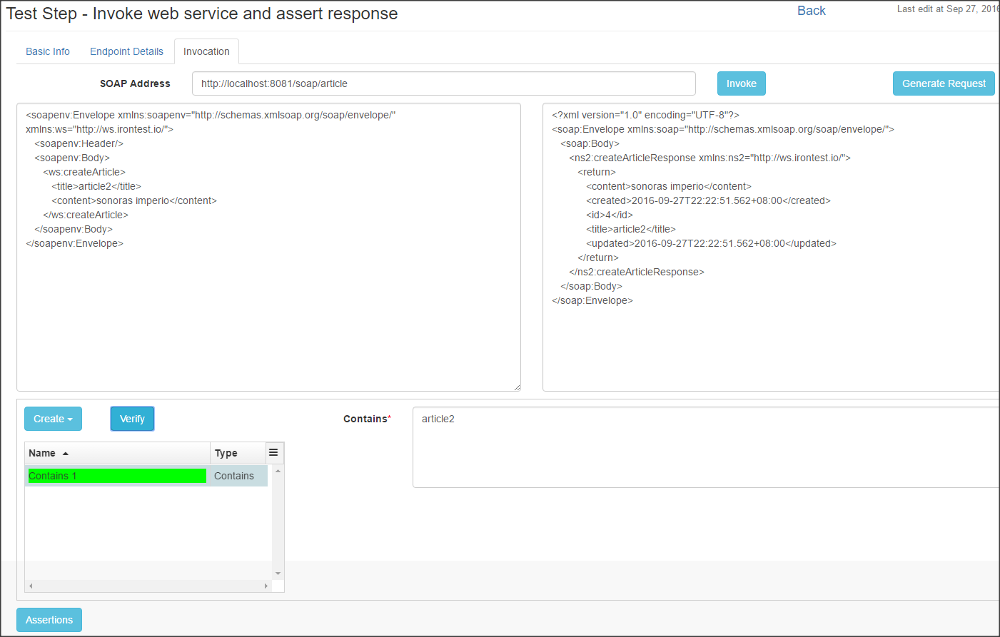
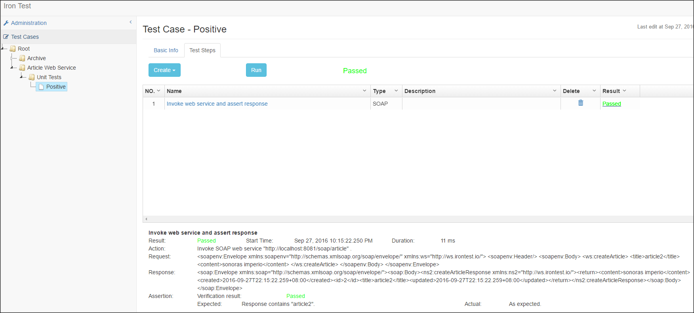

# Iron Test
Iron Test is an open source tool for integration testing APIs such as SOAP web services, databases (Oracle, SQL Server, etc.), WebSphere MQ, IBM Integration Bus (IIB), RESTful web services (TBD), JMS (TBD), etc. with automation. It is suitable for Integration, ESB, SOA and Microservices(TBD) testing. It supports neither performance testing (for now) nor GUI testing.

The tool intends to provide a platform enabling integrating automated testing capabilities for all kinds of API based systems (potentially including mainframe and IOT) so that user does not need to pick up a new set of tools for testing a new type of system.    

The tool is mainly designed for testers and developers, but in the same team/project BAs or architects might also benefit from it.

Table of Contents:

- [Build](#build)
- [Deploy](#deploy)
- [Use](#use)
    - [SOAP Web Service Testing](#soap-web-service-testing)
    - [More Usages](#more-usages)
- [Maintain](#maintain)
- [License](#license)
        
## Build
Prerequisites: JDK 1.7+, Maven 3.x.

Download the latest Iron Test release from [here](https://github.com/zheng-wang/irontest/releases) to your local machine. Extract it, cd to the project directory (in which there is README.md), and run below Maven command

`mvn clean package -pl irontest-core -am -P prod`

This builds Iron Test without MQ/IIB testing features, and an `irontest-core/dist` folder is created containing the files and folders for deployment.

To build Iron Test with MQ/IIB testing features, please refer to the [wiki page](https://github.com/zheng-wang/irontest/wiki/Build-Iron-Test-with-MQ-IIB-Testing-Features) instead.
   
## Deploy
Prerequisites: JRE 1.7+.

Create a folder on any computer/VM that has access to the APIs you want to test. This folder will be referred to as `<IronTest_Home>` hereafter.

Copy all files and folders from `dist` to `<IronTest_Home>`.

To enable Iron Test to interact with databases such as Oracle or SQL Server, prepare JDBC drivers as described on the [wiki page](https://github.com/zheng-wang/irontest/wiki/Interact-with-Databases).

To launch Iron Test application, cd to `<IronTest_Home>` and run below command

`java -jar <jarFilename> server config.yml`

To verify the application is successfully launched, open a web browser (Chrome is preferred), and go to Iron Test home page http://localhost:8081/ui (no ending '/').

If this is the first time you launch the application, you will see two new folders created under `<IronTest_Home>`.

    database - where Iron Test database is located. The database is used to store all test cases, environments, endpoints, etc. you create using Iron Test.
    
    logs - where Iron Test application runtime logs are located.
    
## Use
Open Iron Test home page (http://&lt;host&gt;:8081/ui). 

### SOAP Web Service Testing
Right click on a folder in the tree and select Create Test Case. Give the test case a name.

(You can create your preferred folder structure for managing test cases, by right clicking on folder and selecting needed context menu item)

Under the Test Steps tab, click Create dropdown button, and select SOAP Step to create a SOAP test step. SOAP test step edit view displays. 

Under the Basic Info tab, enter name and (optional) description. No Save button. Iron Test uses automatic saving.
             
Under the Endpoint Details tab, enter SOAP Address. A sample Article web service (http://localhost:8081/soap/article) is bundled, which can be used for playing with Iron Test. Ignore Username and Password fields as they are not used for now.

Under the Invocation tab, click Generate Request button. Click Load button to load the WSDL, select WSDL Operation `createArticle`, and click OK. A sample request is generated.
     
Modify the request as appropriate. Click the Invoke button and you'll see a SOAP response in the right pane. Click the Assertions button to open the assertions pane.
 
In the assertions pane, click Create dropdown button and select Contains Assertion to create a Contains assertion. Modify the Contains field as appropriate, and click the Verify button to verify the assertion. You can also create XPath assertions to verify the SOAP response is as expected in a more accurate way.

Now the test step edit has finished. Click the Back link to return to test case edit view. 

Our test case has only one step. Click the Run button to run the test case. Click the result link for the test step to see only its run report.

Click the result link beside the Run button to see the whole test case run report. This report can be saved as HTML file and used as test evidence in other places such as HP ALM.

### More Usages
Please refer to the [wiki](https://github.com/zheng-wang/irontest/wiki).

## Maintain
**It is highly recommended that you back up `<IronTest_Home>/database` folder regularly.** Remember to shut down the application before backing up.

To shut down the application
    
    On Windows: Ctrl + C
    
    On Linux/Unix: kill -SIGINT <pid>
    
You can tune Iron Test application to suit your runtime needs by changing contents of the config.yml under `<IronTest_Home>`. Refer to [Dropwizard doc](http://www.dropwizard.io/0.9.3/docs/manual/configuration.html) for how to do it. Re-launch the application for the changes to take effect.
    
To move Iron Test to a different folder or computer/VM, just shut down the application, copy the whole `<IronTest_Home>` folder over, and launch the application from there.

## License
Apache License 2.0, see [LICENSE](LICENSE).

