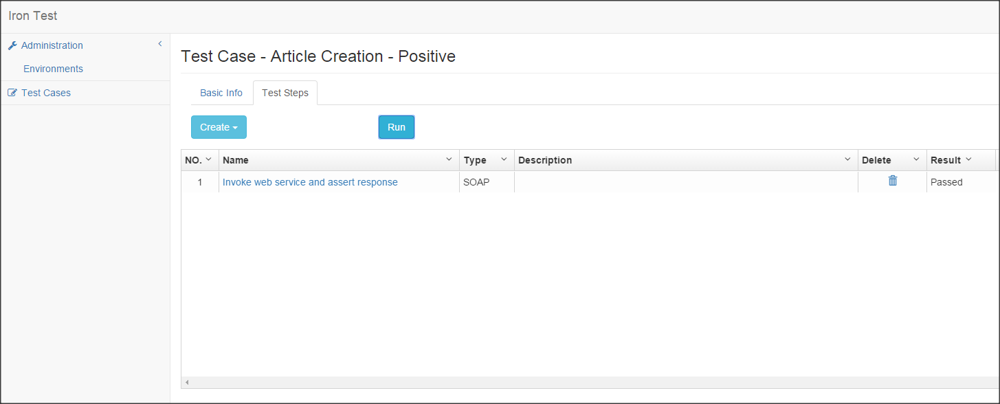
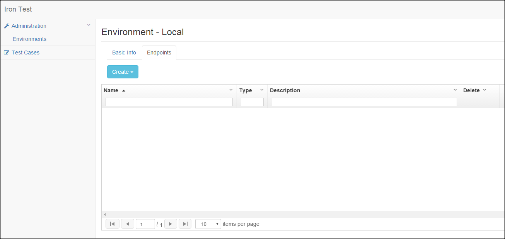
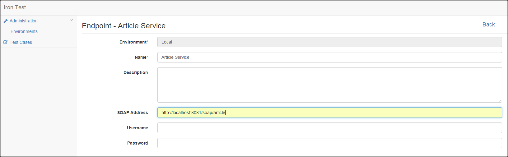
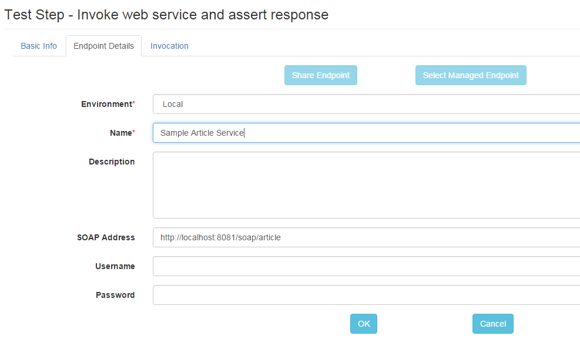
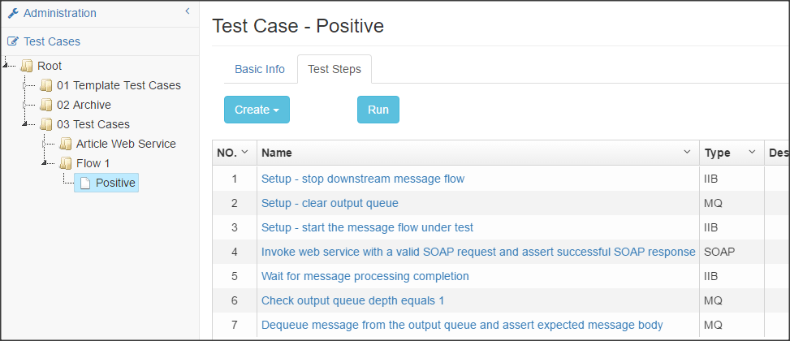

# Iron Test
Iron Test is an open source tool for functionally testing APIs such as SOAP web services, databases (currently only H2), WebSphere MQ, IBM Integration Bus (IIB), RESTful web services (TBD), JMS (TBD), etc. with automation. It helps with SOA, Microservices (TBD) and ESB testing.

It supports neither performance testing (for now) nor GUI testing.

Note: The tool is not yet fully production ready, but you can use it for informal test automation of SOAP web services, MQ and IIB.

Table of Contents:

- [Characteristics](#characteristics)
- [Primary Dependencies](#primary-dependencies)
- [Build](#build)
- [Deploy](#deploy)
- [Maintain](#maintain)
- [Use](#use)
    - [SOAP Web Service Testing](#soap-web-service-testing)
    - [Endpoints Management](#endpoints-management)
        - [Create Managed Endpoint in the Environments area](#create-managed-endpoint-in-the-environments-area)
        - [Share Unmanaged Endpoint from Test Step](#share-unmanaged-endpoint-from-test-step)
    - [IIB Testing](#iib-testing)
- [License](#license)

## Characteristics
- Web UI, so zero installation for end users.
- Centralized test cases and endpoints management, enabling team work by default.
- No middleware.
- Platform independent. Can run on Windows, Linux/Unix and Mac.
        
## Primary Dependencies
Dropwizard, H2 Database, AngularJS, Bootstrap.

## Build
Prerequisites: JDK 1.7+, Maven 3.x, NPM, Bower.

Download the latest Iron Test release to your local machine. cd to the root directory of the project, and run below Maven command

`mvn clean package --projects irontest-core --also-make -P prod`

This builds Iron Test without MQ/IIB testing features, and the seed files for deployment can be found in the irontest/irontest-core/dist folder.

To build Iron Test with MQ/IIB testing features, follow below instructions instead

- Install MQ and IIB libraries to your local Maven repository
    ```
    mvn install:install-file -Dfile="<MQ_Home>/java/lib/com.ibm.mq.jar" -DgroupId=com.ibm -DartifactId=com.ibm.mq -Dversion=<MQ_Version> -Dpackaging=jar
    mvn install:install-file -Dfile="<MQ_Home>/java/lib/com.ibm.mq.jmqi.jar" -DgroupId=com.ibm -DartifactId=com.ibm.mq.jmqi -Dversion=<MQ_Version> -Dpackaging=jar
    mvn install:install-file -Dfile="<MQ_Home>/java/lib/com.ibm.mq.commonservices.jar" -DgroupId=com.ibm -DartifactId=com.ibm.mq.commonservices -Dversion=<MQ_Version> -Dpackaging=jar
    mvn install:install-file -Dfile="<MQ_Home>/java/lib/com.ibm.mq.pcf.jar" -DgroupId=com.ibm -DartifactId=com.ibm.mq.pcf -Dversion=<MQ_Version> -Dpackaging=jar
    mvn install:install-file -Dfile="<MQ_Home>/java/lib/com.ibm.mq.headers.jar" -DgroupId=com.ibm -DartifactId=com.ibm.mq.headers -Dversion=<MQ_Version> -Dpackaging=jar
    mvn install:install-file -Dfile="<MQ_Home>/java/lib/connector.jar" -DgroupId=javax.resource -DartifactId=connector -Dversion=1.3.0 -Dpackaging=jar
	mvn install:install-file -Dfile="<IIB_Home>/classes/ConfigManagerProxy.jar" -DgroupId=com.ibm -DartifactId=ConfigManagerProxy -Dversion=<IIB_Version> -Dpackaging=jar
    mvn install:install-file -Dfile="<IIB_Home>/jre17/lib/ibmjsseprovider2.jar" -DgroupId=com.ibm -DartifactId=ibmjsseprovider2 -Dversion=<IIB_Version> -Dpackaging=jar
    ```

- Check MQ/IIB versions in irontest/irontest-mqiib/pom.xml. If your MQ or IIB version falls outside the range, modify the POM. I haven't tested that version, but Iron Test might work with it. Refer to [this doc](http://maven.apache.org/enforcer/enforcer-rules/versionRanges.html) for more info about Maven version ranges.
    ```
    <mq.version>[7.5.0.3, 7.5.0.6]</mq.version>
    <iib.version>[9.0.0.3, 9.0.0.5]</iib.version>
    ```
 
- Run below Maven command

    `mvn clean package --projects irontest-mqiib --also-make -P prod`

    Seed files for deployment can be found in the irontest/irontest-mqiib/dist folder.
    
## Deploy
Prerequisites: JRE 1.7+.

Copy seed files to any folder on any computer/VM that has access to the APIs you want to test. That folder will be referred to as `<IronTest_Home>` hereafter.

To launch Iron Test application, cd to `<IronTest_Home>` and run below command

`java -jar <jarFilename> server config.yml`

To verify the application is successfully launched, open a web browser (Chrome is preferred), and go to Iron Test home page http://localhost:8081/ui (no ending '/').

If this is the first time you launch the application in the `<IronTest_Home>` folder, you will see two sub-folders created

    database - where Iron Test database is located. The database is used to store all test cases, environments, endpoints, etc. you create using Iron Test.
    
    logs - where Iron Test application runtime logs are located.
    
## Maintain
**It is highly recommended that you back up `<IronTest_Home>/database` folder regularly.** Remember to shut down the application before backing up.

To shut down the application
    
    On Windows: Ctrl + C
    
    On Linux/Unix: kill -SIGINT <pid>
    
You can tune Iron Test application to suit your runtime needs by changing contents of the config.yml under `<IronTest_Home>`. Refer to [Dropwizard doc](http://www.dropwizard.io/0.9.3/docs/manual/configuration.html) for how to do it. Re-launch the application for the changes to take effect.
    
To move Iron Test to a different folder or computer/VM, just shut down the application, copy the whole `<IronTest_Home>` folder over, and launch the application from there.

## Use
Iron Test home page (http://&lt;host&gt;:8081/ui) is test case list. 


#### SOAP Web Service Testing
Create a test case by clicking the Create button. Test case edit view displays. 

Under the Basic Info tab, enter name and (optional) description. Click the Test Steps tab. 


No Save button. Iron Test uses automatic saving.

Under the Test Steps tab, click Create dropdown button, and select SOAP Step to create a SOAP test step. SOAP test step edit view displays. 

Under the Basic Info tab, enter name and (optional) description. Click Endpoint Details tab.
             
Under the Endpoint Details tab, enter SOAP Address. A sample Article web service (http://localhost:8081/soap/article) is bundled, which can be used for playing with Iron Test. Ignore Username and Password fields as they are not used for now. Click Invocation tab.

Under the Invocation tab, click Generate Request button. Click Load button to load the WSDL, select WSDL Operation `createArticle`, and click OK. A sample request is generated.
     
Modify the request as appropriate. Click the Invoke button and you'll see a SOAP response in the right pane. Click the Assertions button to open the assertions pane.
 
In the assertions pane, click Create dropdown button and select Contains Assertion to create a Contains assertion. Modify the Contains field as appropriate, and click the Verify button to verify the assertion. You can also create XPath assertions to verify the SOAP response is as expected in a more accurate way.


Now the test step edit has finished. Click the Back link to return to test case edit view. 

Our test case has only one step. Click the Run button to run the test case, and result is displayed for each test step.



#### Endpoints Management
When we entered SOAP Address under the SOAP test step Endpoint Details tab, we were using unmanaged endpoint. Unmanaged endpoint is specific to a test step. It is invisible to other test steps in the same test case, or other test cases.

To reuse endpoints across test steps or test cases, you can create managed endpoints. Managed endpoint resides in environment. If you haven't created an environment, click the Administration > Environments link in the left panel, and click Create button. A new environment is created and its edit view displays.
 
Under the Basic Info tab, enter name and (optional) description. Click Endpoints tab.



There are two ways to create a managed endpoint: create managed endpoint in the Environments area, share unmanaged endpoint from test step.

##### Create Managed Endpoint in the Environments area
In the 'Local' environment we just created, click Create dropdown button and select SOAP Endpoint to create a managed SOAP endpoint. SOAP endpoint edit view displays. Enter details and Iron Test saves them automatically.



To use the newly created managed endpoint, go to the SOAP test step by clicking its link in the test case edit view, and click the Endpoint Details tab. Click Select Managed Endpoint button to see a SOAP endpoint list popup. 


Click the endpoint name to select it for use in the SOAP test step.

##### Share Unmanaged Endpoint from Test Step
This is a convenient function for you to capture endpoint during test step edit.

Under Endpoint Details tab of a test step with unmanaged endpoint, click Share Endpoint button. Enter details and click OK button. The unmanaged endpoint will be turned into managed.



Notice that while unmanaged endpoint can be edited in test step edit view, managed endpoint can only be edited in the Environments area.
 
#### IIB Testing
If you have been familiar with the SOAP Web Service Testing and Endpoints Management, it will be intuitive for you to do IIB Testing using Iron Test.

Here is a sample test case for (in-server) unit testing an IIB message flow. The message flow (Flow1) has a SOAPInput node to receive SOAP request, and an MQOutput node to output the message to an MQ queue. 

There is a downstream message flow (Flow2) listening to the queue, so to isolate the testing of Flow1, we need some setup steps.

    Setup: stop downstream message flow
    Setup: clear output queue
    Setup: start the message flow under test
    
Then we add below test steps to the same test case

    Invoke web service with a valid SOAP request and assert successful SOAP response
    Check output queue depth equals 1
    Dequeue message from the output queue and assert expected message body
    
Hopefully you are able to DIY now. The result test case looks like below



## License
Apache License 2.0, see [LICENSE](LICENSE).


