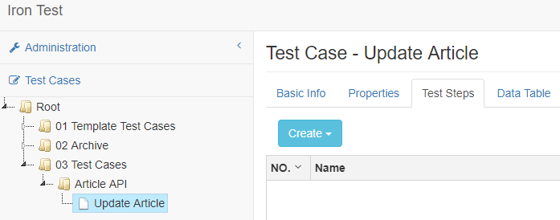
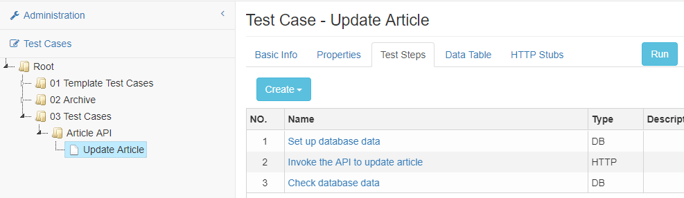
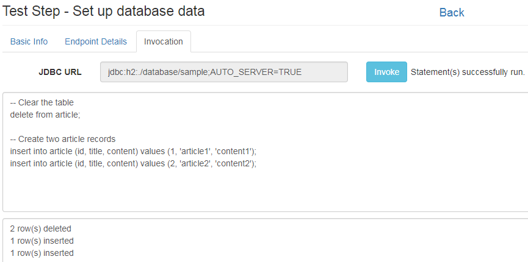
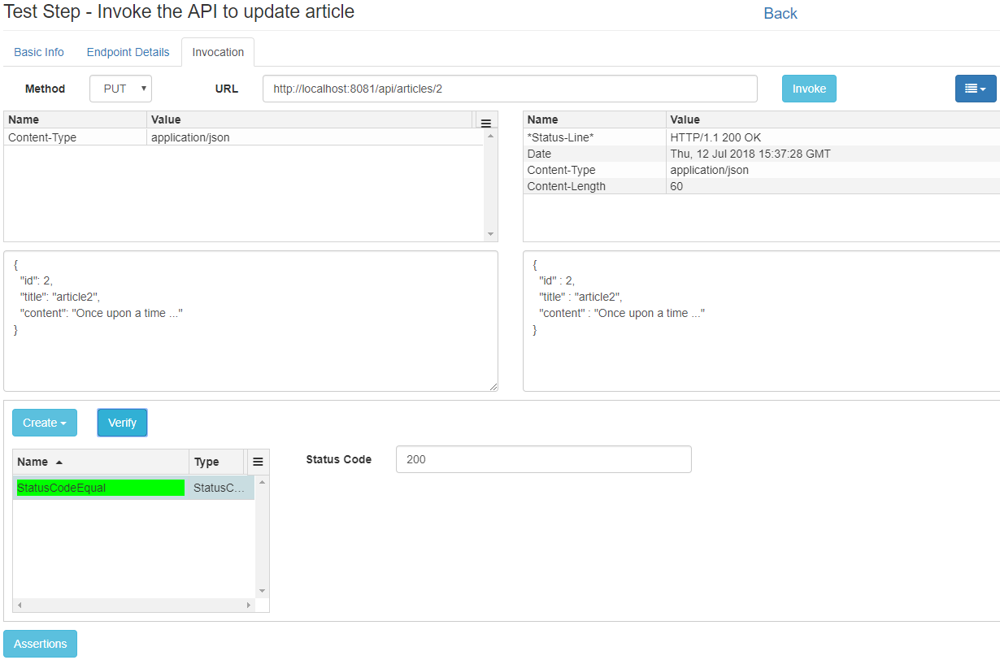
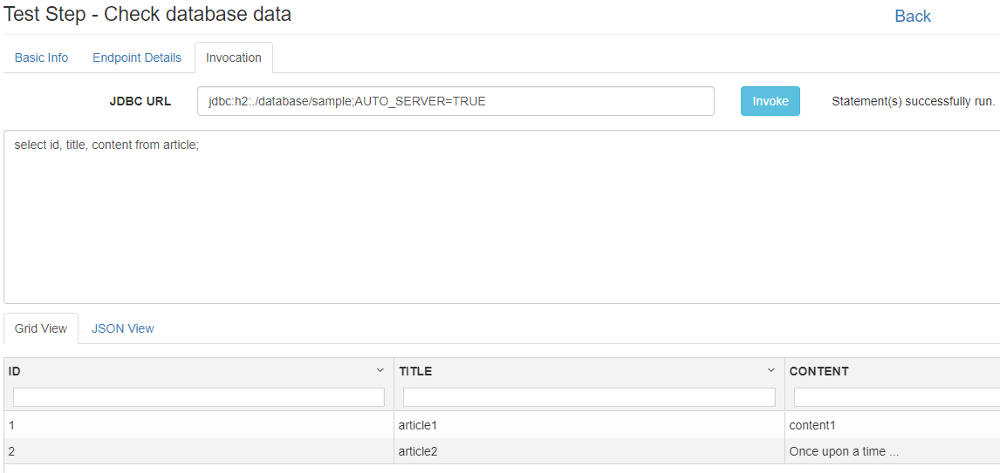
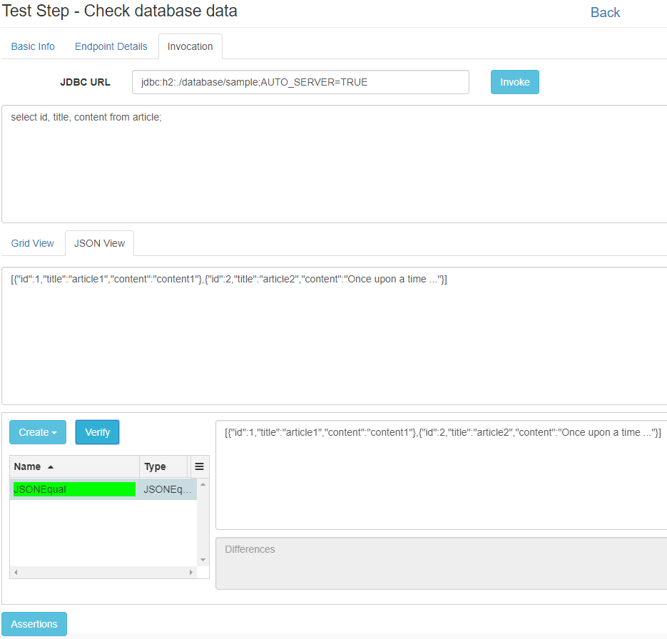
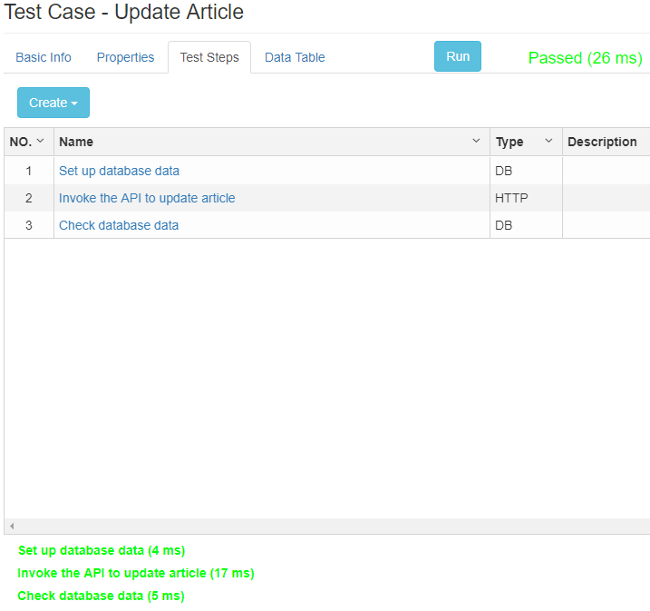
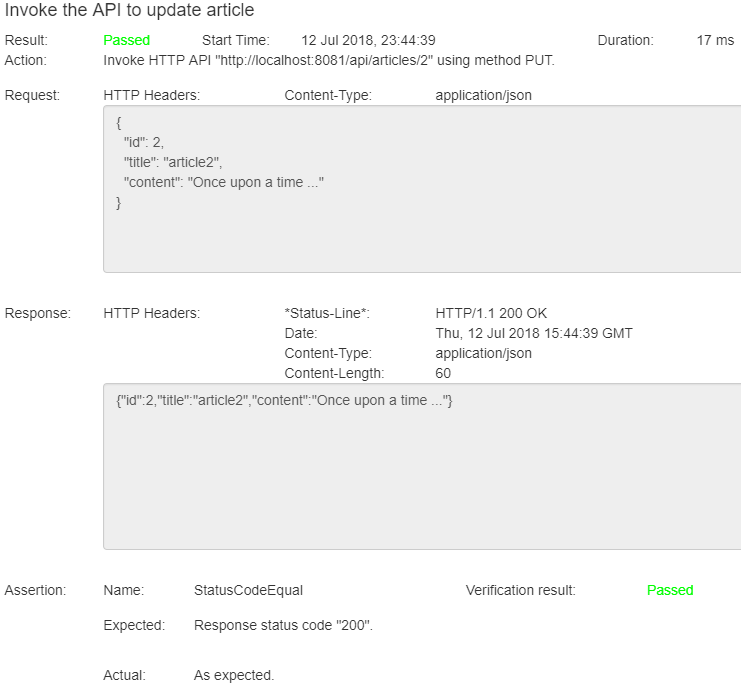

# Iron Test
Iron Test is an open source tool for integration testing a variety of APIs. It is suitable for Integration, ESB, Microservices and SOA testing.

Supported API types
* HTTP
* SOAP
* Relational databases (Oracle, SQL Server, H2)
* JMS (Solace)
* FTP(S)
* AMQP
* IBM MQ
* IBM Integration Bus (IIB)

The tool 
* has GUI, saving user programming skills. Developers also have better experience using GUIed tool, as writing, reading and maintaining code are more brain power draining.
* intends to provide a platform enabling integrating testing capabilities for all types of APIs.
* provides advanced features like unlimited level folder structure for test case management, centralized and environment based endpoints management, user defined properties, data driven testing, HTTP stubs (mock services), full-text test case searching (TBD), and built-in (no VCS) team collaboration (partially done).
* is designed for testers and developers, but in the same team/organization BAs or architects may also benefit from it. The thought here is that API test cases contain valuable business knowledge, and this knowledge should be shared and easily accessible and consumable to everyone in the team/organization.
* does not support performance testing (for now).

Table of Contents:

- [Download](#download)
- [Launch](#launch)
- [Use](#use)
    - [Integrated REST API Testing](#integrated-rest-api-testing)
        - [Create Test Case Outline](#create-test-case-outline)
        - [Populate Step 1](#populate-step-1)
        - [Populate Step 2](#populate-step-2)
        - [Populate Step 3](#populate-step-3)
        - [Run the Test Case](#run-the-test-case)
    - [More Usages and Testing Practices](#more-usages-and-testing-practices)
- [Maintain](#maintain)
- [License](#license)
        
## Download
Download the [latest Iron Test release](https://github.com/zheng-wang/irontest/releases/latest/download/irontest-dist.zip) and unpack it. The created folder will be referred to as `<IronTest_Home>` hereafter.

Alternatively, you can also [build Iron Test by yourself](https://github.com/zheng-wang/irontest/wiki/Build-Iron-Test-by-Yourself).

## Launch
Prerequisites: JRE (Java SE Runtime Environment) or JDK 8+.

Open a command line window, cd to `<IronTest_Home>` and run below command

`java -Djava.net.useSystemProxies=true -jar <jarFilename> server config.yml`

On Windows, alternatively you can simply run `<IronTest_Home>\start.bat`.

Once the application is successfully launched, there will be a log like below displayed in the command line output

`Iron Test started with UI address http://localhost:8090/ui`

Open a web browser, and go to the UI address. 

Though the UI is crossing browsers, Google Chrome is preferred as it is the main browser that is used to test the application.

## Use

### Integrated REST API Testing
We are going to demo how to test a REST API that updates an article in database. 

The API is the sample Article API that is bundled with Iron Test. It does CRUD operations against the Article table in a sample H2 database. The sample database is automatically created under `<IronTest_Home>/database` when Iron Test is launched for the first time.
 
We are planning to have three test steps in our test case 
```
1. Set up database data
2. Invoke the API to update article
3. Check database data
```

#### Create Test Case Outline
First of all, create the (empty) test case by right clicking on a folder in the tree and selecting Create Test Case. Give it a name. The test case edit view shows as below.



You can create your preferred folder structure for managing test cases, by right clicking on folder and selecting needed context menu item.

Now we can add test steps to the test case.

Under the Test Steps tab, click Create dropdown button and select Database Step. Enter the name of step 1 `Set up database data`. Click Back link to return to the test case edit view. Repeat this to add the other two test steps (one HTTP Step and one Database Step). The test case outline is created as shown below.



#### Populate Step 1 
Click the name of step 1 to open its edit view.
          
Under the Endpoint Details tab, enter JDBC URL `jdbc:h2:./database/sample;AUTO_SERVER=TRUE` which will be used by the test step to connect to the sample database. Here `./database/sample` in the URL equals to `<IronTest_Home>/database/sample`, as Iron Test application is launched from directory `<IronTest_Home>`. Then enter Username and Password which can be found in `<IronTest_Home>/config.yml`.

Under the Invocation tab, enter below SQL script.
```
-- Clear the table
delete from article;

-- Create two article records
insert into article (id, title, content) values (1, 'article1', 'content1');
insert into article (id, title, content) values (2, 'article2', 'content2');
```

Click the Invoke button to try it out (run the script), like shown below.



Click the Back link to return to test case edit view.

#### Populate Step 2 
Click the name of step 2 to open its edit view.

Under the Endpoint Details tab, enter URL `http://localhost:8090/api/articles/2`. Ignore Username and Password fields as they are not used in this demo.

Under the Invocation tab, select `PUT` from the Method dropdown list, click the menu dropdown button and select `Show HTTP Headers`.

In the grid above the Request Body text area, add a request HTTP header `Content-Type: application/json` using the Create item in the grid menu (located in the top right corner of the grid). We need this header in the request because the Article API requires it. If it is not provided, the invocation will see error response. 
     
Input the request body for updating article 2.

```
{
  "id": 2,
  "title": "article2",
  "content": "Once upon a time ..."
}
```

Click the Invoke button to try it out and you'll see a successful response in the right pane. 

Click the Assertions button to open the assertions pane. In the assertions pane, click Create dropdown button and select `StatusCodeEqual Assertion` to create a StatusCodeEqual assertion. Enter the expected HTTP response status code (here 200), and click the Verify button to verify the assertion, as shown below.



More information about assertions can be found on this [wiki page](https://github.com/zheng-wang/irontest/wiki/Assertions).

Click the Back link to return to the test case edit view.

#### Populate Step 3  
Click the name of step 3 to open its edit view. 
 
Under the Endpoint Details tab, enter exactly the same information as in step 1 because we are interacting with the same database. The information duplication can be avoided by using `managed endpoints`. Refer to this [wiki page](https://github.com/zheng-wang/irontest/wiki/Endpoints-Management) for more details.

Under the Invocation tab, enter SQL query `select id, title, content from article;`.

Click the Invoke button to try it out (run the query), like shown below.



Click the JSON View tab to see the JSON representation of the SQL query result set.

Click the Assertions button to open the assertions pane. In the assertions pane, click Create dropdown button and select `JSONEqual Assertion` to create a JSONEqual assertion. Copy the JSON string from the JSON View to the Expected JSON field. Click the Verify button to verify the assertion, as shown below. 



Click the Back link to return to the test case edit view.

#### Run the Test Case
Now we have finished editing our test case. It's time to run it. Click the Run button, and you'll see the result for the whole test case beside the Run button, and in the bottom pane an outline of result for all test steps, like shown below. Passed test step is indicated by green color and failed test step by red color.



Click the link for a test step in the bottom pane to open a modal and see the step run report, like shown below.



Click the result link beside the Run button to see the whole test case run report. This report can be saved as HTML file and used as test evidence in other places such as HP ALM.

### More Usages and Testing Practices
Refer to the [wiki pages](https://github.com/zheng-wang/irontest/wiki).

## Maintain
The first time you launch the application, two new folders are created automatically under `<IronTest_Home>`.

    database - where system database and a sample database are located. Both are H2 databases. 
        System database is used to store all test cases, environments, endpoints, etc. you create using Iron Test.
        Sample database is for you to play with Iron Test basic features such as REST API testing or database testing. An Article table is in it.
    
    logs - where Iron Test application runtime logs are located.
    
**It is highly recommended that you back up `<IronTest_Home>/database` folder regularly.** Remember to shut down the application before backing up.

To shut down the application
    
    On Windows: Ctrl + C
    
    On Linux/Unix: kill -SIGINT <pid>
    
You can tune Iron Test application to suit your runtime needs by changing contents of the config.yml under `<IronTest_Home>`. For example, you can change the UI port number through the property `server > applicationConnectors > port` in config.yml. Refer to [Dropwizard doc](https://www.dropwizard.io/1.3.4/docs/manual/configuration.html) for more information. Re-launch Iron Test for the changes to take effect.
    
To move Iron Test to a different folder or computer/VM, just shut down the application, copy the whole `<IronTest_Home>` folder over, and launch the application from there.

## License
Apache License 2.0, see [LICENSE](LICENSE).
