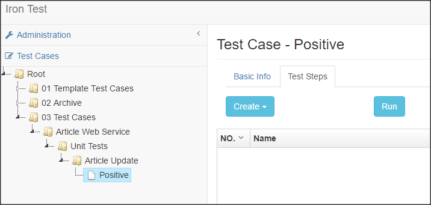
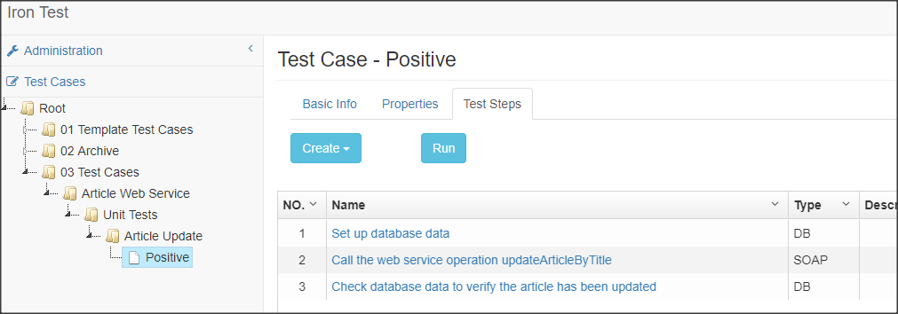
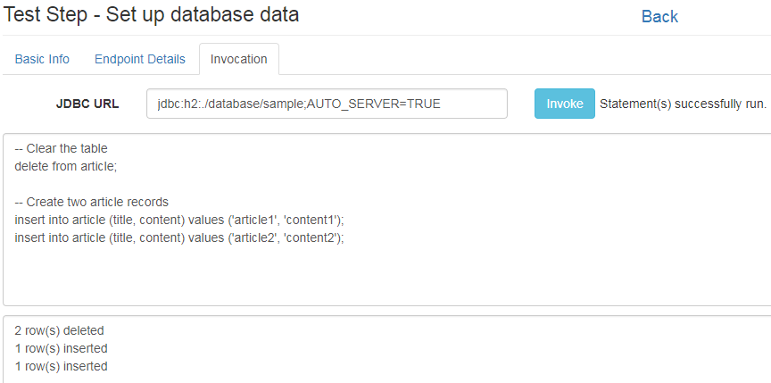
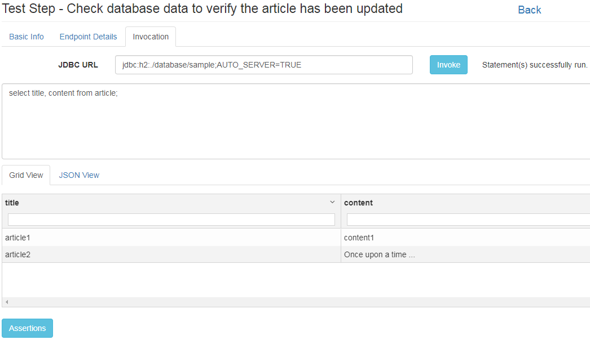
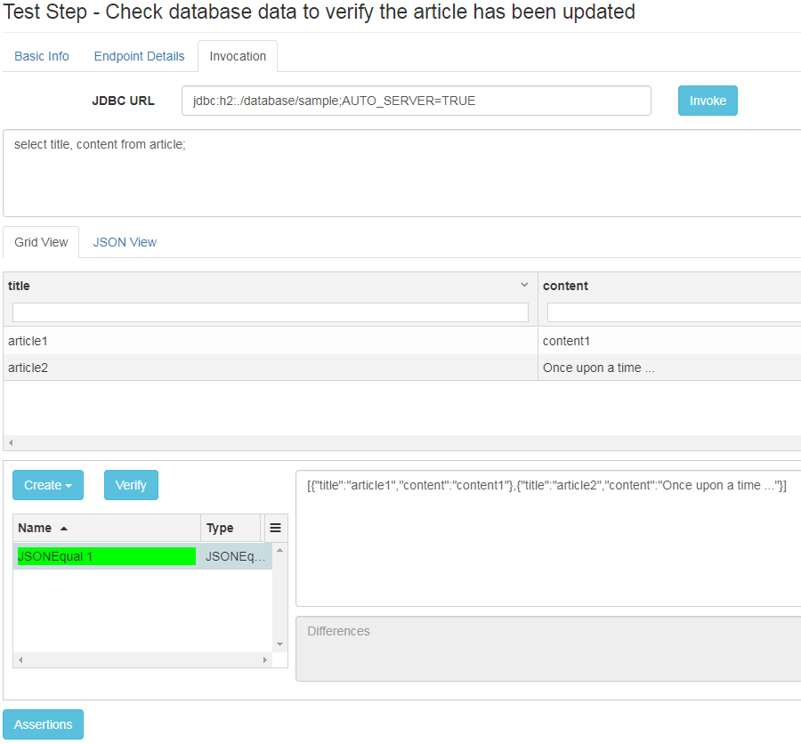
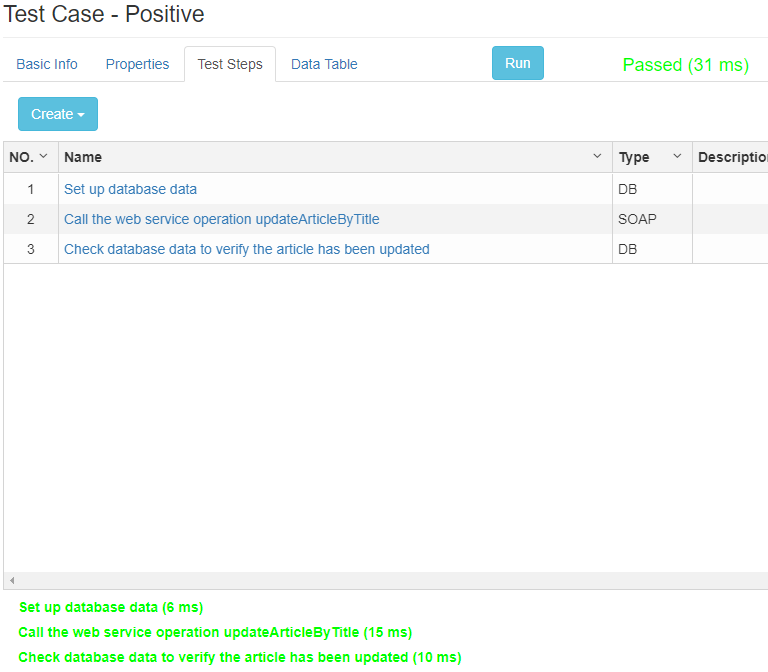
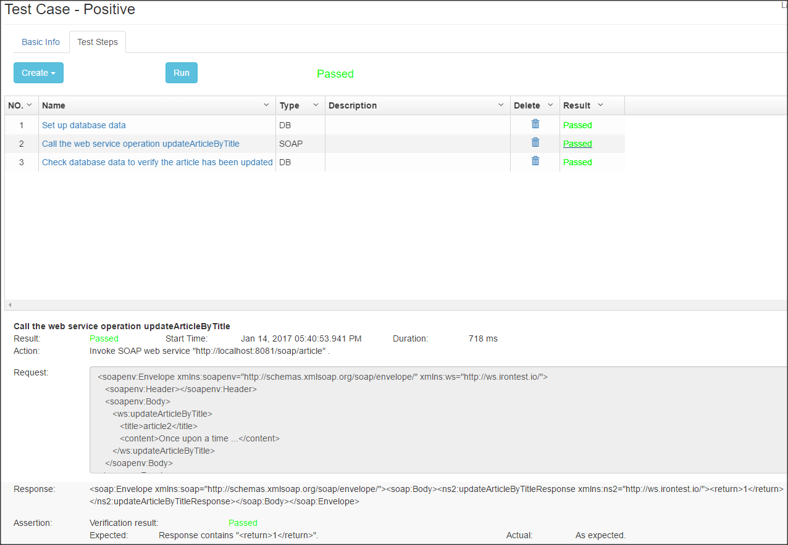

# Iron Test
Iron Test is an open source tool for integration testing APIs such as SOAP web services, databases (Oracle, SQL Server, etc.), WebSphere MQ, IBM Integration Bus (IIB), HTTP APIs (TBD), JMS (TBD), etc. with automation. It is suitable for Integration, ESB, SOA and Microservices(TBD) testing. It supports neither performance testing (for now) nor GUI testing.

The tool 
* has GUI, saving user programming skills.
* intends to provide a platform enabling integrating automated testing capabilities for all kinds of API based systems (potentially including mainframe and IOT) so that user does not have to pick up a new set of tools for testing a new type of system.    
* is designed for testers and developers, but in the same team/organization BAs or architects may also benefit from it. The thought here is that API test cases contain valuable business knowledge, and this knowledge should be shared to all roles across the team/organization and easily accessible to everyone.

Table of Contents:

- [Build](#build)
- [Deploy](#deploy)
- [Launch](#launch)
- [Use](#use)
    - [Integrated SOAP Web Service Testing](#integrated-soap-web-service-testing)
        - [Create Test Case Outline](#create-test-case-outline)
        - [Populate Step 1](#populate-step-1)
        - [Populate Step 2](#populate-step-2)
        - [Populate Step 3](#populate-step-3)
        - [Run the Test Case](#run-the-test-case)
    - [More Usages and Testing Practices](#more-usages-and-testing-practices)
- [Maintain](#maintain)
- [For Developers](#for-developers)
- [License](#license)
        
## Build
Prerequisites: JDK 1.7.x (or 1.8.x), Maven 3.x. JDK 9 is not supported for now. To let Maven use a specific version of JDK installed on the machine, set environment variable JAVA_HOME=<JDK_Install_Path>.

Download the latest Iron Test release from [here](https://github.com/zheng-wang/irontest/releases) to your local machine. Extract it, cd to the project directory (in which there is README.md), and run below Maven command

`mvn clean package -pl irontest-assembly -am -P prod`

An `irontest-assembly/dist` folder is created containing the files and folders for deployment.

Notice that if this is the first time you build Iron Test, it could take 10 minutes (depending on your network speed) for Maven to download all the dependencies. From the second time, you should see the build time decreased to around 40 seconds, as the dependencies are already in your Maven local repository.
  
## Deploy
Create a folder on any computer/VM that has access to the APIs you want to test. This folder will be referred to as `<IronTest_Home>` hereafter.

Copy all files and folders from `dist` to `<IronTest_Home>`.

The build itself can interact with SOAP/HTTP web services and H2 databases. To enable interacting with other types of systems such as Oracle database or WebSphere MQ, please refer to this [wiki page](https://github.com/zheng-wang/irontest/wiki/Interact-with-Other-Systems).

## Launch
Prerequisites: JRE 1.7.x (or 1.8.x). JRE 9 is not supported for now.

To launch Iron Test application, cd to `<IronTest_Home>` and run below command

`java -jar <jarFilename> server config.yml`

On Windows, alternatively you can simply run `<IronTest_Home>\start.bat`. You might want to create a shortcut of it on your Windows Desktop, Task Bar or Start Menu for more convenient launching.

To verify the application is successfully launched, open a web browser, and go to Iron Test home page http://localhost:8081/ui (no ending '/'). 

Though the UI is crossing browsers, Google Chrome is preferred as it is the main browser that is used to test the application.

## Use
Open Iron Test home page (http://localhost:8081/ui). 

### Integrated SOAP Web Service Testing
We are going to demo how to test a web service that updates an article in database by its title. 

The web service is the sample Article web service that is bundled with Iron Test. It does CRUD operations against the Article table in a sample H2 database under `<IronTest_Home>/database` directory. The sample database is automatically created when launching Iron Test for the first time.
 
We are planning to have three test steps in our test case 
```
1. Set up database data
2. Call the web service operation updateArticleByTitle
3. Check database data to verify the article has been updated
```

#### Create Test Case Outline
First of all, create the (empty) test case by right clicking on a folder in the tree and selecting Create Test Case. Give it a name. The test case edit view shows as below.



You can create your preferred folder structure for managing test cases, by right clicking on folder and selecting needed context menu item.

Now we are going to add test steps to the test case.

Under the Test Steps tab, click Create dropdown button and select Database Step. Enter the name of step 1 `Set up database data`. Click Back link to return to the test case edit view. Repeat this to add the other two test steps (one SOAP Step and one Database Step). The test case outline is created as shown below.



#### Populate Step 1 
Click the name of step 1 to open its edit view.
          
Under the Endpoint Details tab, enter JDBC URL `jdbc:h2:./database/sample;AUTO_SERVER=TRUE` which will be used by the test step to connect to the sample database. Here `./database/sample` in the URL equals to `<IronTest_Home>/database/sample`, as Iron Test application is launched from directory `<IronTest_Home>`. Then enter Username and Password which can be found in `<IronTest_Home>/config.yml`.

Under the Invocation tab, enter below SQL script.
```
-- Clear the table
delete from article;

-- Create two article records
insert into article (id, title, content) values (1, 'article1', 'content1');
insert into article (id, title, content) values (2, 'article2', 'content2');
```

Click the Invoke button to try it out (run the script), like shown below.



Click the Back link to return to test case edit view.

#### Populate Step 2 
Click the name step 2 to open its edit view.

Under the Endpoint Details tab, enter SOAP Address `http://localhost:8081/soap/article` which is the address of the sample Article web service bundled with Iron Test. Ignore Username and Password fields as they are not used in this test case.

Under the Invocation tab, click the menu dropdown button and select Generate Request. Click Load button to load the WSDL, select WSDL Operation `updateArticleByTitle`, and click OK. A sample request is generated.
     
Modify the request for updating article2. Click the Invoke button to try it out and you'll see a SOAP response in the right pane. 

Click the Assertions button to open the assertions pane. In the assertions pane, click Create dropdown button and select `Contains Assertion` to create a Contains assertion. Enter the expected string, and click the Verify button to verify the assertion (the SOAP response contains the expected string), as shown below.


More information about assertions can be found on this [wiki page](https://github.com/zheng-wang/irontest/wiki/Assertions).

Click the Back link to return to the test case edit view.
 
#### Populate Step 3  
Click the name of step 3 to open its edit view. 
 
Under the Endpoint Details tab, enter exactly the same information as in step 1 because we are interacting with the same database. The information duplication can be avoided by using `managed endpoints`. Refer to this [wiki page](https://github.com/zheng-wang/irontest/wiki/Endpoints-Management) for more details.

Under the Invocation tab, enter SQL query `select id, title, content from article;`.

Click the Invoke button to try it out (run the query), like shown below.



Click the JSON View tab to see the JSON representation of the SQL query result set.

Click the Assertions button to open the assertions pane. In the assertions pane, click Create dropdown button and select `JSONEqual Assertion` to create a JSONEqual assertion. Copy the JSON string from the JSON View to the Expected JSON field. Click the Verify button to verify the assertion, as shown below. 



Click the Back link to return to the test case edit view.

#### Run the Test Case
Now we have finished editing our test case. It's time to run it. Click the Run button, and you'll see the result for the whole test case beside the Run button, and in the bottom pane an outline of result for all test steps, like shown below. Passed test step is indicated by green color and failed test step by red color.



Click the link for a test step in the bottom pane to open a modal and see the step run report, like shown below.



Click the result link beside the Run button to see the whole test case run report. This report can be saved as HTML file and used as test evidence in other places such as HP ALM.

### More Usages and Testing Practices
Please refer to the [wiki pages](https://github.com/zheng-wang/irontest/wiki).

## Maintain
The first time you launch the application, two new folders are created automatically under `<IronTest_Home>`.

    database - where system database and a sample database are located. Both are H2 databases. 
        System database is used to store all test cases, environments, endpoints, etc. you create using Iron Test.
        Sample database is for you to play with Iron Test basic features such as SOAP web service testing or database testing. An Article table is in it.
    
    logs - where Iron Test application runtime logs are located.
    
**It is highly recommended that you back up `<IronTest_Home>/database` folder regularly.** Remember to shut down the application before backing up.

To shut down the application
    
    On Windows: Ctrl + C
    
    On Linux/Unix: kill -SIGINT <pid>
    
You can tune Iron Test application to suit your runtime needs by changing contents of the config.yml under `<IronTest_Home>`. Refer to [Dropwizard doc](http://www.dropwizard.io/0.9.3/docs/manual/configuration.html) for how to do it. Re-launch the application for the changes to take effect.
    
To move Iron Test to a different folder or computer/VM, just shut down the application, copy the whole `<IronTest_Home>` folder over, and launch the application from there.

## For Developers
Pull requests are welcome.

To launch Iron Test in your IDE (such as IntelliJ IDEA) without producing dist files, under the project directory (in which there is README.md) run below Maven command

    //  no MQ or IIB testing capabilities.
    mvn verify -pl irontest-assembly -am -P dev   

If you work with irontest-mq module or irontest-iib module, first use `mvn install:install-file` to install related jars into your local Maven repository. Refer to corresponding pom.xml and this [wiki page](https://github.com/zheng-wang/irontest/wiki/Interact-with-Other-Systems) for more information about the dependencies and jars. Then copy IIB jars to <Workspace_Dir>/lib/iib/v90 and/or <Workspace_Dir>/lib/iib/v100. Finally, run commands like below

    //  with MQ 8.0 but no IIB testing capabilities
    mvn verify -pl irontest-assembly -am -P dev -Dmq.version=8.0.0.7 -Dmq.version.is80
    //  with IIB 10.0 but no MQ testing capabilities
    mvn verify -pl irontest-assembly -am -P dev -Diib.version=10.0.0.9 -Diib.version.is100        
    //  with MQ 7.5 and IIB 9.0 testing capabilities
    mvn verify -pl irontest-assembly -am -P dev -Dmq.version=7.5.0.6 -Dmq.version.is75 -Diib.version=9.0.0.5 -Diib.version.is90

## License
Apache License 2.0, see [LICENSE](LICENSE).


